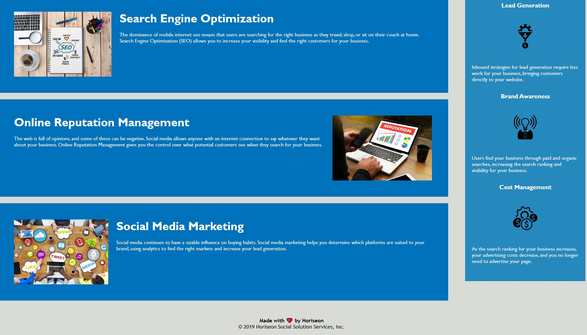

# SEO Website Rework

## Description

This project was to update the website for Horiseon to comply with accessibility standards and enhance search engine optimization. We use semantic HTML elements, logical structure, alt attributes that support accessibility standards, proper heading order and description titles to enable the website to be more user-friendly and inclusive.

Through this project, I received an in-depth, hands-on experience working with HTML semantics as well as reviewing and commenting code.

## Image

The following image demonstrates the web application's appearance:

## Link

https://github.com/kyndalbowers/challenge-01-seo-website-rework

## Credits

Utilized source code from class repo - Module 01 Challenge 01

Collaboration with Group 1 from UCB April 2023 Bootcamp to clarify instructions and to check work.

Referenced LearnTheWeb blog for HTML semantics cheat sheet

## License

MIT License

Copyright (c) 2023 kyndalbowers

Permission is hereby granted, free of charge, to any person obtaining a copy
of this software and associated documentation files (the "Software"), to deal
in the Software without restriction, including without limitation the rights
to use, copy, modify, merge, publish, distribute, sublicense, and/or sell
copies of the Software, and to permit persons to whom the Software is
furnished to do so, subject to the following conditions:

The above copyright notice and this permission notice shall be included in all
copies or substantial portions of the Software.

THE SOFTWARE IS PROVIDED "AS IS", WITHOUT WARRANTY OF ANY KIND, EXPRESS OR
IMPLIED, INCLUDING BUT NOT LIMITED TO THE WARRANTIES OF MERCHANTABILITY,
FITNESS FOR A PARTICULAR PURPOSE AND NONINFRINGEMENT. IN NO EVENT SHALL THE
AUTHORS OR COPYRIGHT HOLDERS BE LIABLE FOR ANY CLAIM, DAMAGES OR OTHER
LIABILITY, WHETHER IN AN ACTION OF CONTRACT, TORT OR OTHERWISE, ARISING FROM,
OUT OF OR IN CONNECTION WITH THE SOFTWARE OR THE USE OR OTHER DEALINGS IN THE
SOFTWARE.

